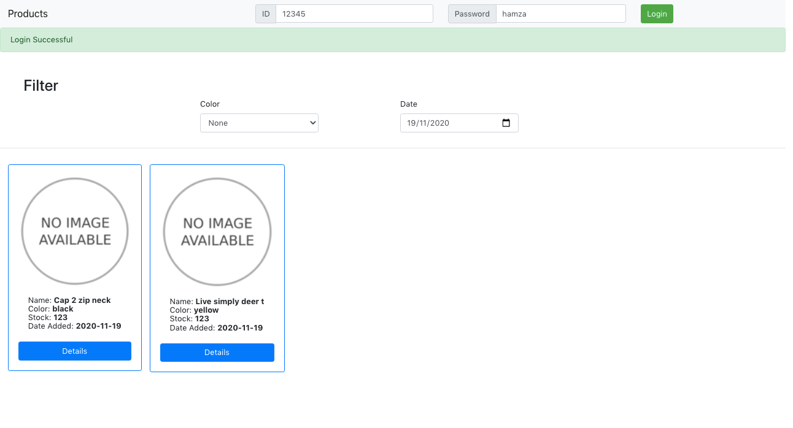
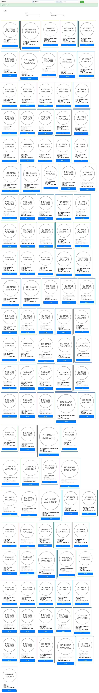

Backend Documentation: https://documenter.getpostman.com/view/6014566/TVRq25ip

### Installation

1. `git clone https://github.com/muhammadh-s/products`
2. `cd backend && npm i`
3. `cd frontend && npm i`
4. `npm run start`

- ID: `12345`
- Password: `hamza`

### Filtered:

### List:

